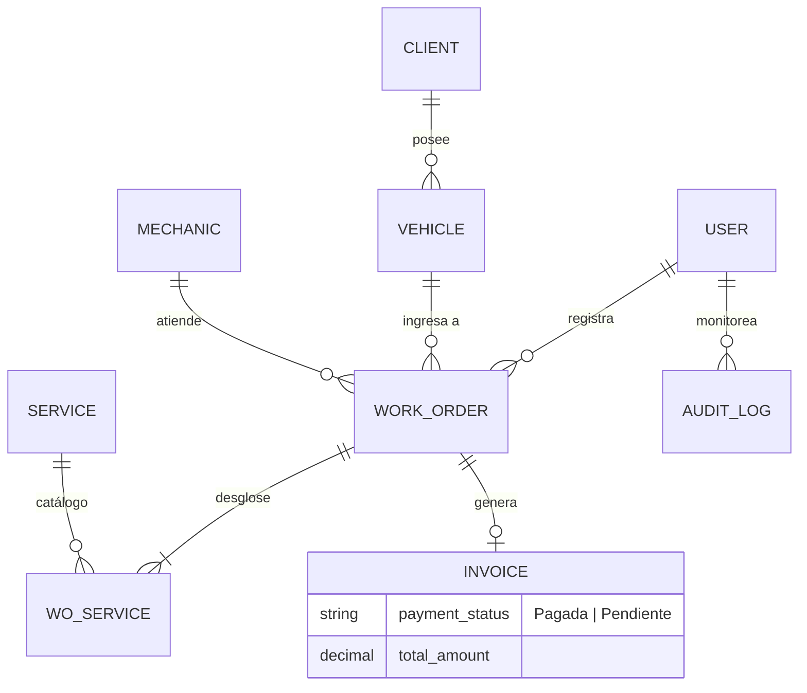

# 🗄️ Diseño de Base de Datos - Dr. Motor

Este documento define la arquitectura de persistencia para el sistema **Dr. Motor**, optimizada para **Microsoft SQL Server 2022** y compatible con **SQLite** para entornos de desarrollo ágil.

---

## 1. Diccionario de Entidades (Esquema Relacional)

### 1.1. Seguridad y Acceso (`users`)
| Atributo | Tipo (SQL Server) | Descripción |
| :--- | :--- | :--- |
| `id` | INT IDENTITY(1,1) | Clave Primaria. |
| `email` | NVARCHAR(255) | Único. Identificador de acceso. |
| `hashed_password` | NVARCHAR(MAX) | Hash de seguridad (Bcrypt). |
| `role` | NVARCHAR(50) | 'admin' o 'recepcionista'. |
| `is_active` | BIT | Estado de la cuenta. |

### 1.2. Gestión de Clientes (`clients`)
| Atributo | Tipo (SQL Server) | Descripción |
| :--- | :--- | :--- |
| `first_name` | NVARCHAR(100) | Nombre(s) del propietario. |
| `last_name` | NVARCHAR(100) | Apellidos. |
| `phone_number` | NVARCHAR(20) | Contacto telefónico. |
| `email` | NVARCHAR(255) | Opcional. Único para notificaciones. |

### 1.3. Parque Automotor (`vehicles`)
| Atributo | Tipo (SQL Server) | Descripción |
| :--- | :--- | :--- |
| `client_id` | INT | FK -> `clients(id)`. |
| `license_plate` | NVARCHAR(20) | Único e Índexado. Placa del vehículo. |
| `vin` | NVARCHAR(50) | Opcional. Único. Número de chasis. |
| `make` / `model` | NVARCHAR(100) | Marca y modelo técnico. |

### 1.4. Operaciones de Taller (`work_orders`)
| Atributo | Tipo (SQL Server) | Descripción |
| :--- | :--- | :--- |
| `status` | NVARCHAR(50) | Ciclo: Pendiente, En Progreso, Completada, Cancelada. |
| `total_amount` | DECIMAL(18,2) | Monto calculado en Bs. |
| `created_by` | INT | FK -> `users(id)`. Responsable de la carga. |

---

## 2. Diagrama Entidad-Relación (Mermaid)



---

## 3. Implementación de Auditoría Nativa (SQL Server)

La auditoría se ejecuta mediante **Triggers** de nivel de base de datos para garantizar que ningún cambio pase desapercibido, incluso si se realiza fuera de la aplicación.

### 3.1. Captura de Contexto de Usuario
Utilizamos `SESSION_CONTEXT` para inyectar el ID del usuario desde FastAPI:
```sql
-- Ejecutado por SQLAlchemy en cada transacción
EXEC sp_set_session_context @key = N'user_id', @value = :id;
```

### 3.2. Trigger de Auditoría de Ejemplo (T-SQL)
```sql
CREATE TRIGGER trg_audit_vehicles_update
ON vehicles
AFTER UPDATE
AS
BEGIN
    INSERT INTO audit_logs (table_name, record_id, operation_type, old_value, new_value, changed_by_user_id, timestamp)
    SELECT 
        'vehicles',
        CAST(i.id AS VARCHAR),
        'UPDATE',
        (SELECT d.* FOR JSON PATH, WITHOUT_ARRAY_WRAPPER), -- Estado anterior
        (SELECT i.* FOR JSON PATH, WITHOUT_ARRAY_WRAPPER), -- Estado nuevo
        CAST(SESSION_CONTEXT(N'user_id') AS INT),
        GETDATE()
    FROM inserted i
    JOIN deleted d ON i.id = d.id;
END;
```

---

## 4. Optimizaciones para SQL Server 2022

1.  **Índices Columnstore**: Recomendados para la tabla `audit_logs` si el volumen de datos supera el millón de registros.
2.  **JSON Nativo**: Las columnas `old_value` y `new_value` permiten consultas directas usando `JSON_VALUE` y `OPENJSON`.
3.  **Compresión de Datos**: Aplicada a tablas históricas de auditoría para reducir el consumo de almacenamiento en disco.

---

## 5. Mapeo ORM (SQLAlchemy)

Para asegurar la compatibilidad, se utiliza la siguiente configuración en los modelos:
- **String**: Se mapea a `NVARCHAR` para soporte de caracteres especiales (tildes/enie).
- **Float**: Se mapea a `DECIMAL` o `Numeric` para precisión financiera.
- **DateTime**: Se utiliza `DATETIME2` para mayor precisión en marcas de tiempo de auditoría.

---

*Proyecto Dr. Motor - Documentación de Arquitectura de Datos v2.0*
